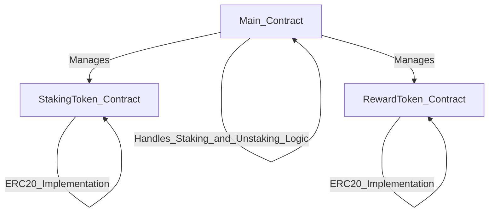

# Basic Staking for Dummies

**What is DeFi Staking?**

Imagine you have some digital coins, like a cryptocurrency. Instead of just holding onto them, you can "stake" them in a DeFi (Decentralized Finance) protocol to earn more coins over time. It’s a bit like putting money in a savings account to earn interest, but instead of a bank, you're using a smart contract on a blockchain.

**How Does It Work?**

A use the example of the contracts that im going to make, but you can see examples in real life like Olympus Protocol on Ethereum Mainnet.

1. **Choose a Staking Platform:** You find a DeFi platform that offers staking. Let’s say the platform allows you to stake a token called **StakingToken**.

2. **Lock Your Tokens:** You decide to participate, so you lock (stake) your **StakingToken** in the platform's **Main Contract**. This contract is a smart contract on the blockchain that manages everything automatically.

3. **Earn Rewards:** While your tokens are staked, the platform rewards you with another token called **RewardToken**. The longer you stake, the more **RewardToken** you earn.

4. **Unstaking:** If you want to stop staking, you can withdraw (unstake) your **StakingToken** from the contract. You still keep the **RewardToken** you earned.

**Why Stake?**

Staking in a DeFi protocol allows you to earn rewards passively. It’s an easy way to make your digital assets grow without actively trading them.

---

This explanation gives a basic overview, using a relatable analogy to make the concept of DeFi staking more understandable.

### Contracts 
- **Main Contract** ➡️ Manage all the project, where the Staking and Unstaking logic are.
- **StakingToken Contract** ➡️ the token that users use to receive rewards from the staking platform, this contract have the ERC20 standard implementation
- **RewardToken Contract** ➡️ the token to rewards users, his contract have the ERC20 standard implementation.

### A small diagram explaining how the contracts are connected.

