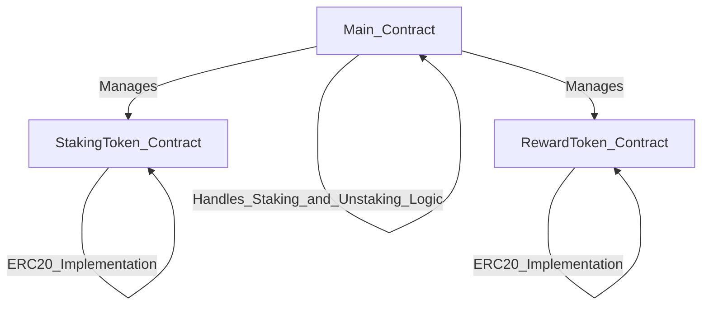

# Basic Staking for Dummies

**What is DeFi Staking?**

Imagine you have some digital coins, like a cryptocurrency. Instead of just holding onto them, you can "stake" them in a DeFi (Decentralized Finance) protocol to earn more coins over time. It’s a bit like putting money in a savings account to earn interest, but instead of a bank, you're using a smart contract on a blockchain.

**How Does It Work?**

A use the example of the contracts that im going to make, but you can see examples in real life like Olympus Protocol on Ethereum Mainnet.

1. **Choose a Staking Platform:** You find a DeFi platform that offers staking. Let’s say the platform allows you to stake a token called **StakingToken**.

2. **Lock Your Tokens:** You decide to participate, so you lock (stake) your **StakingToken** in the platform's **Main Contract**. This contract is a smart contract on the blockchain that manages everything automatically.

3. **Earn Rewards:** While your tokens are staked, the platform rewards you with another token called **RewardToken**. The longer you stake, the more **RewardToken** you earn.

4. **Unstaking:** If you want to stop staking, you can withdraw (unstake) your **StakingToken** from the contract. You still keep the **RewardToken** you earned.

**Why Stake?**

Staking in a DeFi protocol allows you to earn rewards passively. It’s an easy way to make your digital assets grow without actively trading them.

---

This explanation gives a basic overview, using a relatable analogy to make the concept of DeFi staking more understandable.

### Contracts 
- **Main Contract** ➡️ Manage all the project, where the Staking and Unstaking logic are.
- **StakingToken Contract** ➡️ the token that users use to receive rewards from the staking platform, this contract have the ERC20 standard implementation
- **RewardToken Contract** ➡️ the token to rewards users, his contract have the ERC20 standard implementation.

### A small diagram explaining how the contracts are connected.



## Quickstart
```
git clone https://github.com/gab0071/basic-staking-project-foundry
cd basic-staking-project-foundry
forge install 
forge build
```
## Usage

### OpenZeppelin

[OpenZeppelin Contracts Docs](https://docs.openzeppelin.com/contracts/4.x/)
<br><br>
[OpenZeppelin GitHub Repo](https://github.com/OpenZeppelin/openzeppelin-contracts)
<br>

### Installing OpenZeppelin Contracts Package

```bash
forge install OpenZeppelin/openzeppelin-contracts --no-commit
```

## Start a local node

```
make anvil
```

## Deploy

This will default to your local node. You need to have it running in another terminal in order for it to deploy.

```
make deploy
```

## Deploy - Other Network

[See below](#deployment-to-a-testnet-or-mainnet)

## Testing
```
forge test
```

or if use Makefile

```
make test
```

### Test Coverage
```
forge coverage
```


## Deployment to a testnet or mainnet

1. Setup environment variables

You'll want to set your `SEPOLIA_RPC_URL` and `PRIVATE_KEY` as environment variables. You can add them to a `.env` file, similar to what you see in `.env.example`.

- `PRIVATE_KEY`: The private key of your account (like from [metamask](https://metamask.io/)). **NOTE:** FOR DEVELOPMENT, PLEASE USE A KEY THAT DOESN'T HAVE ANY REAL FUNDS ASSOCIATED WITH IT.
  - You can [learn how to export it here](https://metamask.zendesk.com/hc/en-us/articles/360015289632-How-to-Export-an-Account-Private-Key).
- `SEPOLIA_RPC_URL`: This is url of the sepolia testnet node you're working with. You can get setup with one for free from [Alchemy](https://alchemy.com/?a=673c802981)

Optionally, add your `ETHERSCAN_API_KEY` if you want to verify your contract on [Etherscan](https://etherscan.io/).

1. Get testnet ETH
Head over to [faucets.chain.link](https://faucets.chain.link/) and get some testnet ETH. You should see the ETH show up in your metamask.

2. Deploy
```
make deploy-sepolia
```


## Estimate gas
You can estimate how much gas things cost by running:

```
forge snapshot
```

And you'll see and output file called `.gas-snapshot`


## Formatting
To run code formatting:

```
forge fmt
```

## Layout of Contract
[Check this readme](layoutContract.md)

<p align="center">
<a href="mailto:ccatellatech@gmail.com" target="_blank" >
  
</a> 
<br/>
  Made with ❤️ by <b>catellaTech</b>.
<p/>
